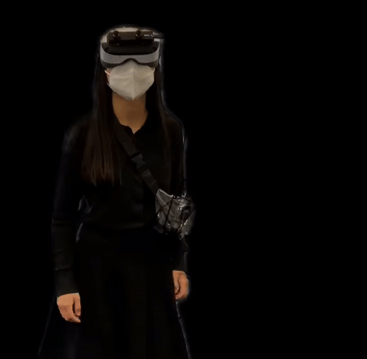
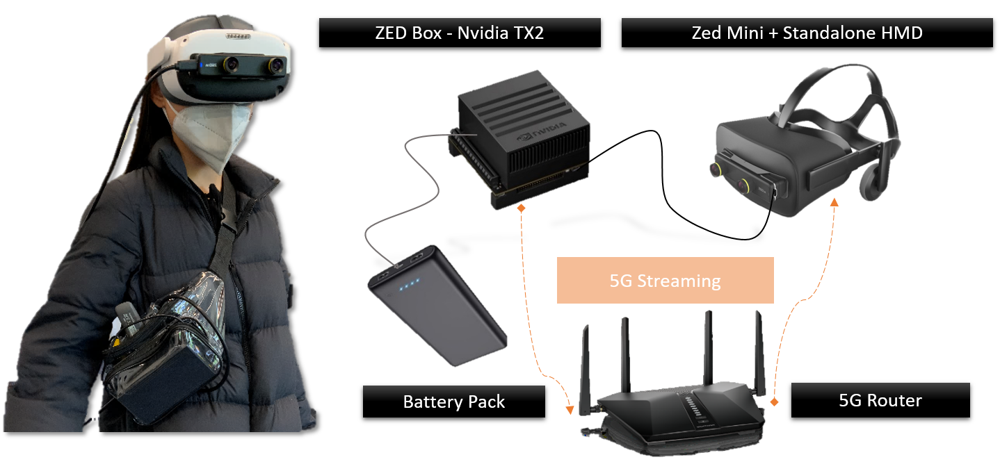

# Mixed Reality Tunneling Effects

This repository contains the Unity C# code for creating mixed reality tunneling effects, a method to balance the trade-off between the limited render performance and high visual quality of video see-through head-mounted displays (VST-HMDs) through fusing images of two types of camera sensors with different
resolutions and frame rates. 


[](https://www.youtube.com/watch?v=yIDXRc3FDJA "WATCH THE TEASER ON YOUTUBE")

It also demonstrates how we could convert a gray-scale low resolution VST of a VR headset to an untethered HD colorful VST HMD using sensor fusion technique. 





## Feature 1: Basic MR Tunneling Effects

We merge a color video stream from an external stereoscopic camera with the grayscale VST from the VR headset. The external high-resolution VST
displayed at the central foveal to the para-peripheral region of the
human visual field complements the low-resolution, low-latency
grayscale VST at the far peripheral region, producing a tunneling
effect, which simulates the human foveal and peripheral vision, with
the potential to reduce cybersickness as in the tunneling effect in
immersive VR.


## Feature 2: MR Tunneling with Head Speed Accomodation 

MR Tunneling with head speed detection accommodates the user’s head movement speed by fading out the external VST when fast head movements are detected, thus
potentially compensating for video streaming latency. 


## Feature 3: Foveated MR Tunneling Effects

The foveated MR Tunneling effect displays the center of the external VST based on the tracked user eye movements.


## Software Version

1. **VR Headset**: The project was implemented targeting the [Pico Neo 3 Pro Eye](https://www.picoxr.com/us/neo3.html) standalone VR headset with the [Pico Unity SDK version 2.0.4](https://developer-global.pico-interactive.com/). 

2. **Stereo Camera**: We use the ZED Mini mixed reality stereoscopic camera with the ZED SDK version 3.7.3. 

3. **Unity**: This project was tested on Unity version 2021.3.4f1.    

4. **Gstreamer Unity Plugin** :
This Unity project extends the ```mrayGstreamerUnity``` (https://github.com/mrayy/mrayGStreamerUnity) project, and makes it compatible with any [arm64 Android device](https://github.com/mrayy/mrayGStreamerUnity/issues/32). As the results, the plugin is compatible with other standalone VR headsets such as the Oculus Quest 2.

5. Note: the user interface components are not included in the open source repository as it requires a paid Unity asset the [Unity VR UI toolkit](https://assetstore.unity.com/packages/tools/gui/vr-uikit-bootstrap-your-vr-app-with-ease-128236?locale=zh-CN).
    
## Accelerated G-Streamer Pipeline


In order to minimize the video streaming and rendering latency ( what is also called the motion to photon latency ), the Gstreamer pipeline used for this project is optimized using the [Nvidia Deep Stream SDK](https://developer.nvidia.com/deepstream-sdk), which can drastically decrease the [video encoding latency](https://github.com/stereolabs/zed-gstreamer/issues/39).

The Gstreamer pipeline was tested on a ZED Box, running on Ubuntu 18.04.6 LTS, Jetpack 4.6, and ZED SDK version 3.7.3, Gstreamer version 1.14.5, and the [ZED-Gstreamer plugin](https://github.com/stereolabs/zed-gstreamer). The average MTP latency was around 150 ms for pipeline1 using a dedicated Wifi-6 router for streaming.

To use the pipeline, connect the VR headset and the streaming device to the same local network. 

**Pipeline1: streaming HD720 stereoscopic video to the standalone Pico VR headset at 30 fps**

```
 gst-launch-1.0 zedsrc camera-resolution=2 camera-fps=30 stream-type=2  ! autovideoconvert format=BGRA ! queue !  nvvideoconvert ! nvv4l2h264enc  maxperf-enable=1 control-rate=1 bitrate=8000000 vbv-size=530000 ! 'video/x-h264, format=(string)BGRA, stream-format=(string)byte-stream, width=(int)1280, height=(int)1440,  preset-level=(int)1' ! h264parse ! rtph264pay config-interval=-1 pt=96  ! udpsink clients=[VR_HEADSET_IP]:30000 max-bitrate=80000000000 sync=false async=false 
```

**Test pipeline: streaming HD720 with real-time computer vision and object detection features at 15fps**

```
gst-launch-1.0 zedsrc stream-type=2 od-enabled=true od-detection-model=0 camera-resolution=2 camera-fps=15 ! queue ! zeddemux is-depth=false  name=demux demux.src_left! queue ! zedodoverlay ! autovideoconvert ! omxh264enc! 'video/x-h264, stream-format=(string)byte-stream' ! h264parse ! rtph264pay config-interval=-1 pt=96 ! queue ! udpsink clients=[VR_HEADSET_IP]:30000 max-bitrate=30000000 sync=false async=false demux.src_aux ! queue ! zedodoverlay ! autovideoconvert  ! omxh264enc !  'video/x-h264, stream-format=(string)byte-stream' ! h264parse ! rtph264pay config-interval=-1 pt=96 ! queue ! udpsink clients=[VR_HEADSET_IP]:30000 max-bitrate=30000000 sync=false async=false
```

For more implementation details of building an untethered VR device from a standalone VR headset via sensor fusion, please check out the publication. 

## Citation 

If you find this repository useful for your research and work, please cite this work: 

```bibtex
@article{Li2022MixedRT:inpress,
  title={Mixed Reality Tunneling Effects for Stereoscopic Untethered
Video-See-Through Head-Mounted Displays},
  author={Ke Li and Susanne Schmidt and Reinhard Bacher and Wim Leemans and Frank Steinicke},
  journal={2022 IEEE International Symposium on Mixed and Augmented Reality (ISMAR)},
  year={\noop{3001}in press}
}
```

## Acknowledgement

This work was supported by DASHH (Data Science in Hamburg -
HELMHOLTZ Graduate School for the Structure of Matter) with
the Grant-No. HIDSS-0002, and the German Federal Ministry of
Education and Research (BMBF).